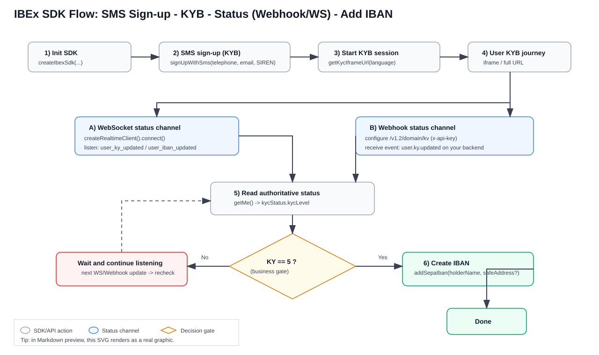
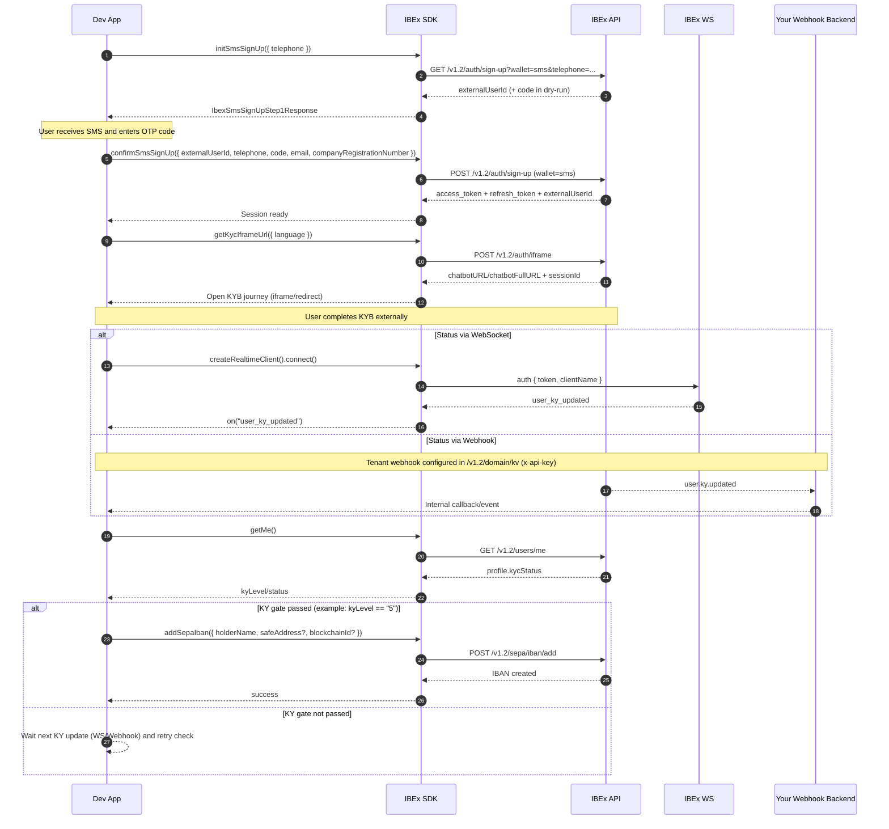

# IBEX FI SDK Integration Flow (SMS Signup -> KYB -> Status -> IBAN)

This page gives a developer-oriented flow for:

1. SMS sign-up
2. KYB onboarding
3. KY status tracking via webhook (your backend) or IBEx WebSocket
4. IBAN creation only when your KY gate is satisfied (`KY=5` in your business rule)

---

## Graphic Diagram (SVG)



---

## 1) End-to-end Flow Diagram

```mermaid
flowchart TD
    A[Start] --> B[Create SDK instance]
    B --> C1[Step 1: Trigger OTP<br/>sdk.initSmsSignUp]
    C1 --> C2[User enters OTP code]
    C2 --> C3[Step 2: Confirm OTP<br/>sdk.confirmSmsSignUp]
    C3 --> D{KYB required?}
    D -- Yes --> E[Start KYB session<br/>sdk.getKycIframeUrl]
    D -- No --> H[Read profile status<br/>sdk.getMe]
    E --> F[User completes KYB in iframe/full URL]
    F --> G{How to receive updates?}

    G -- WebSocket --> G1[Connect sdk.createRealtimeClient]
    G1 --> G2[Listen user_ky_updated / user_iban_updated]
    G2 --> H

    G -- Webhook --> G3[Configure tenant webhook target<br/>/v1.2/domain/kv with x-api-key]
    G3 --> G4[Your backend receives user.ky.updated]
    G4 --> H

    H --> I{KY gate passed?<br/>example: kyLevel == "5"}
    I -- No --> J[Wait and keep listening]
    J --> G
    I -- Yes --> K[Create IBAN<br/>sdk.addSepaIban]
    K --> L[Optional check<br/>sdk.getSepaIbans]
    L --> M[Done]
```

## 1b) Sequence Diagram



## 1c) ASCII Drawing (Quick Visual)

```text
+----------------+        +----------------+        +----------------+
|    Dev App     |        |    IBEx SDK    |        |    IBEx API    |
+----------------+        +----------------+        +----------------+
        |                          |                          |
        | initSmsSignUp()          |                          |
        |------------------------->| GET /auth/sign-up?sms    |
        |                          |------------------------->|
        |                          |<-------------------------|
        |<-------------------------| externalUserId (+code)   |
        |                          |                          |
        | (user enters OTP code)   |                          |
        |                          |                          |
        | confirmSmsSignUp()       |                          |
        |------------------------->| POST /auth/sign-up sms   |
        |                          |------------------------->|
        |                          |<-------------------------|
        |<-------------------------| tokens + externalUserId  |
        |                          |                          |
        | getKycIframeUrl()        |                          |
        |------------------------->| POST /auth/iframe        |
        |                          |------------------------->|
        |                          |<-------------------------|
        |<-------------------------| chatbotURL/sessionId     |
        |                          |                          |
        | user completes KYB       |                          |
        | (iframe/full page)       |                          |
        |                          |                          |
        |             Status channel (choose one)             |
        |                          |                          |
        |  A) WS: createRealtimeClient().connect()            |
        |------------------------->| auth token               |
        |                          |-------------> +--------------------+
        |                          |              |      IBEx WS        |
        |                          |<-------------| user_ky_updated     |
        |<-------------------------| event        +--------------------+
        |                          |
        |  B) Webhook: API calls your backend endpoint
        |                          |
        |                          |<-----------+-----------------------+
        |                          |            |  Your Backend Webhook |
        |                          |            +-----------------------+
        |                          |
        | getMe()                  |
        |------------------------->| GET /users/me
        |                          |------------------------->|
        |                          |<-------------------------|
        |<-------------------------| kycStatus.kycLevel      |
        |                          |
        | if kyLevel == "5"        |
        |------------------------->| addSepaIban()
        |                          | POST /sepa/iban/add
        |                          |------------------------->|
        |                          |<-------------------------|
        |<-------------------------| IBAN created             |
        |                          |
```

---

## 2) SDK Methods and API Mapping

- `sdk.initSmsSignUp(request)` -> `GET /v1.2/auth/sign-up?wallet=sms&telephone=...`
  - triggers OTP and returns `externalUserId` (step 1)
- `sdk.confirmSmsSignUp(request)` -> `POST /v1.2/auth/sign-up` with `wallet=sms`
  - confirms OTP with `externalUserId` + `code` from step 1 (step 2)
  - KYC individual: `telephone` + `code` + `externalUserId` (required)
  - KYB company: add `email` and `companyRegistrationNumber` (SIREN)
- `sdk.getKycIframeUrl(request?)` -> `POST /v1.2/auth/iframe`
  - returns `chatbotURL`, `chatbotFullURL`, `sessionId`, `alreadySent`
- Realtime WS option: `sdk.createRealtimeClient()`
  - listen at least `user_ky_updated` and `user_iban_updated`
  - after a status signal, call `sdk.getMe()` to fetch current `kycStatus`
- Webhook option (backend/tenant config): `PUT` or `PATCH /v1.2/domain/kv` (`x-api-key`)
  - recommended event fan-out includes `user.ky.updated` and `user.iban.updated`
- IBAN creation: `sdk.addSepaIban(payload)` -> `POST /v1.2/sepa/iban/add`

---

## 3) Minimal Implementation Skeleton (TypeScript)

```typescript
import { createIbexSdk } from "@ibex/sdk";

const sdk = createIbexSdk({
  apiBaseUrl: process.env.IBEX_API_URL!,
  rpId: process.env.IBEX_RP_ID,
});

async function signupSmsThenKyb() {
  // Step 1: trigger OTP
  const step1 = await sdk.initSmsSignUp({
    telephone: "+33612345678",
    phonePolicy: "frMobile",
  });

  // Step 2: confirm OTP (use step1.code in dry-run, or prompt user for code)
  const userCode = step1.code ?? await promptUserForOtp();
  await sdk.confirmSmsSignUp({
    externalUserId: step1.externalUserId,
    telephone: "+33612345678",
    code: userCode,
    email: "ops@company.fr",
    companyRegistrationNumber: "123456789",
  });

  // Start KY/KYB session (iframe or redirect)
  const ky = await sdk.getKycIframeUrl({ language: "fr" });
  // Open ky.chatbotURL (iframe) or ky.chatbotFullURL (redirect) in your app UX

  // Option A: WebSocket status channel
  const ws = sdk.createRealtimeClient({ clientName: "my-app" });
  ws.on("user_ky_updated", async () => {
    await maybeCreateIbanWhenKyPassed();
  });
  await ws.connect();
}

async function maybeCreateIbanWhenKyPassed() {
  const me = await sdk.getMe();
  const kyLevel = me.kycStatus?.kycLevel;

  // Business gate requested: create IBAN only when KY=5
  if (String(kyLevel) !== "5") return;

  await sdk.addSepaIban({
    holderName: "Company Main Account",
  });
}
```

---

## 4) Notes for `KY=5` Gate

- The API examples often show KYC levels like `0`, `1`, `2`, but your integration rule can still use `KY=5` if this is your internal KYB acceptance gate.
- Keep the gate in one place (single function) so both webhook and WS paths use the same decision logic.
- After receiving a KY update signal, always re-read authoritative status (`sdk.getMe()`) before calling `addSepaIban`.

